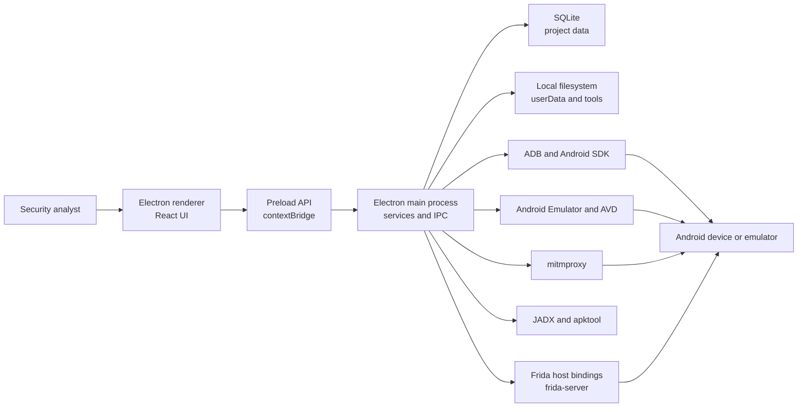

# MobSec Studio Application Blueprint

This blueprint defines MobSec Studio as a serious open-source desktop security
platform. It is intended for maintainers, contributors, security reviewers,
release engineers, and advanced users who need a complete product and
engineering map.

Use this document together with:

- `README.md` for user-facing overview and quick start.
- `docs/architecture.md` for current implementation details.
- `docs/RELEASE.md` for release mechanics.
- `docs/TROUBLESHOOTING.md` for operational support.
- `SECURITY.md` for vulnerability reporting and responsible-use boundaries.

## Executive Summary

MobSec Studio is a local-first Android security workbench for authorized mobile
application assessment. It combines Android device control, emulator
management, APK inspection, decompilation, HTTP/HTTPS interception, request
replay, Frida instrumentation, logcat review, and project-scoped local
persistence into one desktop application.

The project should be treated as a professional security engineering product,
not a loose wrapper around command-line tools. The application must remain:

- Local-first: no required cloud account or telemetry.
- Typed: shared contracts define IPC, events, and domain models.
- Secure by default: privileged work stays in the main process.
- Cross-platform: Windows, Linux, and macOS decisions are deliberate.
- Inspectable: workflows produce visible state, logs, and recoverable errors.
- Extensible: new tools fit into stable service, IPC, store, and UI patterns.
- Responsible: features support authorized testing and clear user consent.

## Product Mission

MobSec Studio helps mobile security teams move faster without losing rigor. It
provides one coherent workspace for tasks that are usually spread across
terminals, proxies, decompilers, emulator consoles, Frida scripts, log streams,
and notes.

The product should reduce operational friction while preserving expert control.
It should not hide security complexity behind vague magic. When an operation is
risky, privileged, device-dependent, or likely to fail on some platforms, the UI
should make the state and next action clear.

## Target Users

| User | Needs | Product implications |
| --- | --- | --- |
| Mobile penetration tester | Fast APK review, traffic capture, bypasses, reproducible notes | Strong APK/JADX/Proxy/Repeater/Frida integration |
| AppSec engineer | Repeatable validation and regression checks | Project history, exports, consistent findings, deterministic flows |
| Malware analyst | Static and runtime inspection in a local lab | Isolated projects, safe file handling, deep search, readable logs |
| Security researcher | Scriptable runtime exploration | Frida library, REPL, trace tools, event stream, presets |
| QA/security automation engineer | Device matrix and repeatable checks | Device management, emulator setup, future automation hooks |
| Open-source contributor | Clear boundaries and reviewable changes | Typed contracts, contribution docs, CI, maintainable modules |

## Product Principles

1. Local ownership.
   User data, captures, scripts, APKs, and tool downloads stay on the analyst
   machine unless the user explicitly exports them.

2. Expert transparency.
   The application should show what it is doing: commands, progress, tool
   versions, active device, selected project, and error context.

3. Main-process authority.
   Filesystem access, process spawning, ADB, proxying, certificates, Frida, and
   SDK operations belong in the Electron main process.

4. Renderer containment.
   The renderer is a UI client. It must use the typed preload API and must not
   gain direct Node or Electron capabilities.

5. Graceful degradation.
   Missing root, missing SDK tools, partial JADX failures, unauthorized ADB
   devices, and platform limitations should be handled as guided states.

6. Cross-platform honesty.
   Windows, Linux, and macOS packaging and runtime behavior differ. The app
   should encode those differences instead of pretending they do not exist.

7. Responsible dual-use design.
   The project supports authorized security work. It should avoid stealth,
   persistence, credential theft, or unauthorized access workflows.

## Scope

### In Scope

- Android device and emulator discovery.
- Wireless and USB ADB workflows.
- Android SDK and toolchain setup.
- APK static analysis.
- JADX decompilation and source search.
- mitmproxy-based HTTP/HTTPS capture.
- Repeater request replay and inspection.
- Frida server management for authorized rooted or root-capable targets.
- Frida scripting, built-in bypasses, recon, tracing, and live events.
- Logcat streaming, filtering, and export-ready review.
- Local project storage and workflow state.
- Release packaging for Windows, Linux, and macOS.

### Out Of Scope For The Core App

- Cloud synchronization as a required product dependency.
- Multi-user hosted collaboration.
- Unauthorized device access.
- Persistence, stealth, or post-exploitation features.
- Credential harvesting workflows.
- Automatic exploitation of third-party targets.
- Shipping private APK samples or proprietary tool binaries in the repository.

## System Context



## Architectural Model

MobSec Studio uses the standard Electron trust split:

| Layer | Responsibility | Must not do |
| --- | --- | --- |
| Renderer | UI, stores, user interaction, visual state | Direct filesystem, child processes, direct Electron imports |
| Preload | Typed allow-listed bridge | Business logic, broad generic IPC passthrough |
| Main | Services, IPC handlers, persistence, tools, process lifecycle | Trust unvalidated renderer input |
| External tools | ADB, emulator, scrcpy, mitmproxy, JADX, apktool, Frida | Own app state directly |

### Core Design Rule

Every new privileged capability should follow this path:

```text
shared type -> IPC channel -> main service -> IPC handler -> preload wrapper
-> renderer store -> UI component
```

Shortcuts around this path create long-term maintenance and security problems.

## Major Modules

| Module | Primary value | Technical owner |
| --- | --- | --- |
| Projects | Isolated workspaces and persistent state | Database service and project UI |
| Devices | USB, wireless, active device, state refresh | Device and ADB services |
| Emulator | SDK setup, AVD lifecycle, app install, key actions | SDK setup and emulator services |
| Mirror | Embedded device interaction | scrcpy and mirror services |
| Proxy | HTTP/HTTPS capture and CA workflow | Proxy and CA services |
| Repeater | Manual replay, mutation, history, export | Repeater service and UI panels |
| APK Analyzer | Static summary, findings, metadata, risk inventory | APK analyzer service modules |
| JADX | Decompile projects, file tree, search, large-file handling | JADX service and store |
| Frida | Runtime instrumentation, recon, bypasses, tracing | Frida service and agent |
| Logcat | Device logs with structured filtering | Logcat service and store |
| Settings | Toolchain, SDK, devices, projects, storage, health | Settings tab and service stores |
| Other Tools | Future operational tools such as guided root workflows | Other-tools service |

## Data Model

Persistent state lives in Electron `userData` and is project-scoped when
possible.

```text
<userData>/
  data/
    mobsec.db
  logs/
  tools/
  avd/
  captures/
  scripts/
  tmp/
```

Core tables:

| Table | Purpose |
| --- | --- |
| `projects` | Project identities and timestamps |
| `settings` | Active project and app settings |
| `captured_requests` | Proxy request and response records |
| `repeater_tabs` | Repeater request state and history |
| `frida_scripts` | User-managed Frida scripts |
| `frida_presets` | Strategy and monitor presets |

Data rules:

- Do not store secrets in logs unless explicitly redacted or user-controlled.
- Keep generated analysis output discoverable and removable.
- Keep temporary files under owned temp directories.
- Use migrations for schema changes.
- Avoid storing absolute paths when a portable relative path is sufficient.

## IPC Contract Strategy

IPC is the product's internal API. It should be stable, typed, and auditable.

Every IPC method should define:

- Channel name in `src/shared/ipc-channels.ts`.
- Request and response types in `src/shared/api.ts` or `src/shared/types.ts`.
- Main-process validation in the IPC handler or service.
- Preload wrapper in `src/preload/index.ts`.
- Renderer usage through stores or controlled components.

Result pattern:

```ts
type IpcResult<T> =
  | { ok: true; data: T }
  | { ok: false; error: string }
```

IPC review checklist:

- Are all renderer inputs validated?
- Does the method expose only the minimum necessary capability?
- Does it leak host paths, secrets, logs, or raw command output unnecessarily?
- Does it return actionable errors?
- Does it handle app shutdown and active-device changes?

## Event Model

Long-running tools should stream status through main-process events and
renderer subscriptions.

Event categories:

- State events: device list, active device, proxy status, Frida status.
- Progress events: tool install, SDK setup, JADX progress.
- Data events: proxy requests, logcat lines, Frida console and live events.
- Lifecycle events: mirror status, emulator status, process exit.

Event rules:

- Events should be typed.
- Events should be bounded or summarized in renderer stores.
- Noisy streams must have pause, filtering, or ring-buffer behavior.
- Renderer state should recover after tab switches and route changes.

## External Tooling Strategy

External tools are dependencies, not architecture. The app should normalize
their behavior behind services.

| Tool | Service expectation |
| --- | --- |
| ADB | Device discovery, shell, push, install, root probes, wireless connect |
| Android SDK | Install, detect, verify, manage AVD requirements |
| Emulator | Start, stop, restart, boot progress, app install |
| scrcpy | Mirror lifecycle and input bridge |
| mitmproxy | Proxy subprocess and captured flow ingestion |
| apktool | APK resource and manifest assistance |
| JADX | Decompile, progress, file tree, search |
| Frida | Host bindings, server install, attach/spawn, RPC and events |

Tooling rules:

- Detect versions and paths explicitly.
- Prefer app-managed tool paths under `userData/tools`.
- Support user-installed tools when safe.
- Make reinstall and reveal-location actions available.
- Keep downloads resumable or at least recoverable.
- Verify extracted binaries before use where practical.

## Security Model

MobSec Studio is both a security tool and a privileged desktop app. Its own
security posture must be treated seriously.

### Trust Boundaries

| Boundary | Trusted side | Untrusted or semi-trusted side |
| --- | --- | --- |
| Renderer to main IPC | Main handler after validation | Renderer input |
| Local APK parsing | Analyzer process logic | APK contents |
| Frida scripts | User-authorized target execution | Imported scripts and CodeShare code |
| Proxy capture | Local storage after capture | Network traffic content |
| ADB shell | Structured service command | Package names, serials, user input |
| Filesystem operations | Resolved app-owned directories | User-provided paths |

### Security Requirements

- `contextIsolation` remains enabled.
- Node integration remains disabled in the renderer.
- IPC methods validate all untrusted arguments.
- ADB shell input uses structured arguments or explicit quoting.
- Recursive delete and move operations must stay inside known owned roots.
- Imported Frida scripts are treated as user-controlled code.
- Logs should avoid unnecessary sensitive data.
- Certificate installation flows must be explicit and reversible where possible.

## Responsible-Use Boundary

The project should keep a clear ethical line.

Allowed design intent:

- Authorized testing.
- Local lab research.
- Defensive validation.
- Education in controlled environments.
- User-owned device and app assessment.

Rejected design intent:

- Unauthorized access.
- Covert persistence.
- Credential theft.
- Stealth deployment.
- Bypassing user consent.
- Targeting third parties without permission.

## UX Blueprint

The UI should feel like a professional analyst workbench:

- Dense but readable.
- Tool-first, not marketing-first.
- Clear active project and active device at all times.
- Fast route switching without losing state.
- Visible process status for long-running tasks.
- Recoverable errors with next steps.
- Tables and lists optimized for scanning.
- Editors and logs optimized for keyboard use.
- No hidden destructive operations.

### Global Navigation

Top-level sections should remain stable:

- Dashboard
- Proxy
- Repeater
- APK Analyzer
- JADX
- Frida
- Logcat
- Emulator or Device workspace
- Other Tools
- Settings

### Empty States

Empty states should answer:

- What is missing?
- Why does it matter?
- What can the user do next?
- Is the operation blocked by platform, permissions, or tool installation?

### Error States

Errors should include:

- Human-readable summary.
- Technical detail when useful.
- A next action.
- A way to retry, reveal logs, reinstall tools, or change device.

## Platform Blueprint

### Windows

Windows is the primary packaging target today.

Requirements:

- NSIS installer.
- Correct executable and taskbar icon.
- Native module rebuild compatibility.
- PowerShell-safe scripts.
- Stable ADB/tool paths with spaces.

### Linux

Linux support should be treated as first-class.

Requirements:

- x64 and arm64 tarballs.
- Install script that handles archive layout.
- Desktop file and icon installation.
- ADB permission guidance.
- Sandbox and native module handling.
- Avoid Windows-only paths or assumptions.

### macOS

macOS should be built and smoke-tested on macOS.

Requirements:

- x64 and arm64 DMG.
- Correct app icon.
- Hardened runtime readiness.
- Future signing and notarization.
- Tool path compatibility with app bundles.

## Performance Blueprint

High-risk performance areas:

- Large APK extraction.
- Large JADX projects.
- Noisy logcat streams.
- Long proxy captures.
- Large response bodies in Repeater.
- Heavy Frida event streams.
- Monaco editor with large files.

Performance requirements:

- Use pagination, virtualization, or bounded buffers for large lists.
- Avoid blocking the renderer with heavy parsing.
- Stream progress for long-running tasks.
- Protect file viewers with large-file handling.
- Keep capture stores bounded in memory.
- Persist heavy history in SQLite, not only in renderer state.
- Profile before large refactors.

## Observability Blueprint

The app should be diagnosable without a debugger.

Minimum observability:

- Main-process logs under `userData/logs`.
- Structured service status objects.
- Clear subprocess exit codes.
- Captured stderr/stdout summaries where safe.
- Tool version and path display.
- User-facing health panels in Settings.

Future improvements:

- Export diagnostic bundle with redaction.
- Per-service log level controls.
- Structured JSON log option.
- Internal health report for GitHub issues.

## Testing Blueprint

The project should evolve toward a layered test suite.

| Layer | Purpose | Example coverage |
| --- | --- | --- |
| Typecheck | Contract safety | Shared types, IPC shapes, renderer props |
| Unit tests | Pure logic | APK analyzers, parsers, filters, path helpers |
| Service tests | Main-process behavior | Repeater, database migrations, tool detection |
| Agent tests | Frida agent modules | Strategy selection, recon formatting |
| Renderer tests | UI state | Stores, filters, tab state |
| E2E smoke tests | Critical workflows | Launch, project create, APK load, logcat state |
| Manual device tests | Real platform behavior | ADB, Frida, proxy, emulator, wireless |

Current required validation:

```bash
pnpm typecheck
pnpm lint
pnpm build
```

Target CI maturity:

- Pull request checks on Windows.
- Linux CI for typecheck and build.
- macOS CI for packaging readiness.
- Release workflow artifacts on tags.
- Optional nightly smoke matrix.

## Release Blueprint

Release channels:

- Beta: frequent, feature-rich, may have platform caveats.
- Stable: signed, smoke-tested, documented, conservative.
- Nightly: optional future automation for testers.

Release requirements:

- Version bump in `package.json`.
- Changelog update.
- Typecheck, lint, build pass.
- Frida agent rebuilt.
- Platform artifacts built.
- Smoke test checklist completed.
- GitHub Release with checksums.
- Known limitations documented.

Artifacts should not be committed to Git. They belong in GitHub Releases or a
dedicated package distribution channel.

## Repository Blueprint

Important paths:

| Path | Role |
| --- | --- |
| `src/main` | Main process, services, IPC, persistence, tools |
| `src/preload` | Typed context bridge |
| `src/renderer` | React UI, stores, components |
| `src/shared` | Shared API, IPC channels, domain types |
| `src/agent` | Frida agent source |
| `resources` | Built-in scripts and generated agent bundles |
| `scripts` | Build, packaging, icon, probe helpers |
| `docs` | Architecture, release, troubleshooting, blueprint |
| `.github` | CI, release workflow, issue and PR templates |

Repository rules:

- Do not commit `node_modules`, `out`, `release`, installers, or local logs.
- Do not commit private APKs, captures, device data, or credentials.
- Generated Frida agent bundles are committed because the packaged app uses
  them and they are deterministic build outputs.
- Keep docs updated with user-facing changes.
- Prefer small focused commits after the initial import.

## Extension Blueprint

### Add A New Tool Section

1. Define shared types.
2. Add IPC channels.
3. Implement a main-process service.
4. Add IPC handlers.
5. Expose preload wrappers.
6. Add a Zustand store.
7. Add UI tab or panel.
8. Add event streaming if the operation is long-running.
9. Add Settings health and install/reinstall controls if external tools are
   required.
10. Add docs and validation notes.

### Add A New APK Analyzer

1. Add a focused module under `src/main/services/apk`.
2. Make it tolerant of malformed APKs.
3. Return structured findings with severity and evidence.
4. Wire the result into the APK summary type.
5. Render it in APK Analyzer without blocking existing sections.
6. Add sample-driven tests when the test suite exists.

### Add A New Frida Capability

1. Implement agent logic under `src/agent`.
2. Expose RPC or event output with typed payloads.
3. Update shared Frida intelligence types.
4. Update main Frida service orchestration.
5. Add UI controls and event rendering.
6. Rebuild the agent with `pnpm build:agent`.
7. Document root, ABI, and target-app assumptions.

## Roadmap

### Near Term

- Expand automated test coverage.
- Add stronger Linux smoke testing.
- Improve release checksum automation.
- Add diagnostic bundle export.
- Add richer report export for APK and project findings.
- Continue hardening Frida and JADX large-output workflows.

### Mid Term

- Add proxy match/replace rules.
- Add Repeater variables, collections, diffs, and assertions.
- Add first-class project import/export.
- Add WebSocket inspection.
- Add Frida Gadget workflow for non-root devices.
- Add APK dependency and SBOM view.
- Add call graph and taint-style navigation for JADX output.

### Long Term

- Signed Windows and macOS releases.
- Package repository support for Linux.
- Scriptable workflow automation.
- Optional local-only plugin model.
- Larger device and emulator compatibility matrix.
- Professional reporting pack for consultants and AppSec teams.

## Risk Register

| Risk | Impact | Mitigation |
| --- | --- | --- |
| Renderer privilege expansion | App compromise surface grows | Keep contextBridge-only API and review IPC |
| Shell injection through ADB/tool commands | Host or device command abuse | Structured args, validation, quoting, tests |
| Large APK/JADX projects freeze UI | Poor UX and data loss | Streaming, workers, size limits, pagination |
| Native module packaging drift | Platform launch failures | Platform smoke tests and release checklist |
| Frida version mismatch | Runtime instrumentation failure | ABI/version detection and reinstall path |
| Proxy CA misuse | User trust-store risk | Explicit UI, warnings, uninstall guidance |
| Accidental commit of builds or secrets | Repository bloat or exposure | `.gitignore`, secret scans, review discipline |
| Ambiguous root tooling | Device damage risk | Guided steps, disclaimers, no opaque automation |

## Governance Blueprint

The project should use lightweight but clear governance.

Maintainer responsibilities:

- Protect the security boundary.
- Review dual-use implications.
- Keep CI green.
- Keep release notes honest.
- Prioritize reproducible bugs.
- Require focused PRs.
- Document platform caveats.

Contributor expectations:

- Follow `CONTRIBUTING.md`.
- Use authorized testing examples.
- Include validation commands.
- Add screenshots for UI changes.
- Explain security-sensitive changes.
- Keep public discussions respectful and technical.

Decision model:

- Small fixes: maintainer review and merge.
- Risky IPC/tooling/security changes: deeper review required.
- Major product direction: issue or discussion before implementation.
- Release readiness: maintainer checklist and smoke test evidence.

## Definition Of Done

A feature is done when:

- User workflow is complete.
- Main-process ownership is respected.
- IPC contracts are typed and validated.
- Renderer state survives normal navigation.
- Loading, empty, error, success, and retry states exist.
- Cross-platform assumptions are documented.
- `pnpm typecheck`, `pnpm lint`, and `pnpm build` pass.
- Docs are updated when behavior changes.
- Security-sensitive behavior is reviewed.

## North Star

MobSec Studio should become the desktop workbench that mobile security teams can
trust for daily work: powerful enough for experts, clear enough for repeatable
team workflows, local enough for sensitive assessments, and engineered well
enough that open-source contributors can extend it without destabilizing the
whole system.
