# MobSec Studio System Context

This document explains the public high-level system context for MobSec Studio.
It is intentionally limited to the application boundary, major runtime layers,
main service domains, local storage, external tools, Android targets, and
assessment inputs and outputs.

It does not describe private planning, governance, roadmap commitments, or
internal release decisions.

## Context Diagram

```mermaid
flowchart TB
  Analyst["Security analyst\nAuthorized assessment"]:::actor

  subgraph Desktop["Analyst workstation"]
    direction TB

    subgraph Electron["MobSec Studio desktop app"]
      direction TB
      Renderer["Renderer UI\nReact tabs, Zustand stores, Monaco viewers"]:::ui
      Preload["Preload bridge\nTyped window.api"]:::boundary
      Main["Main process\nIPC validation and service orchestration"]:::core
      Renderer --> Preload
      Preload --> Main
    end

    subgraph ServiceDomains["Main-process service domains"]
      direction LR
      Workspace["Workspace\nProjects, settings, database"]:::service
      DeviceControl["Device control\nADB, wireless, SDK, emulator"]:::service
      StaticAnalysis["Static analysis\nAPK Analyzer, JADX"]:::service
      TrafficTools["Traffic tools\nProxy, Repeater, CA workflow"]:::service
      RuntimeTools["Runtime tools\nFrida, Logcat, Mirror"]:::service
      Toolchain["Toolchain\nInstall, cache, health checks"]:::service
    end

    subgraph LocalState["Local storage and bundled resources"]
      direction LR
      SQLite["SQLite WAL database\nProjects, captures, scripts, presets"]:::data
      UserData["Electron userData\nLogs, temp files, captures, generated output"]:::data
      ToolCache["Managed tools cache\nADB, SDK, scrcpy, mitmproxy, apktool, JADX, Frida"]:::data
      Bundled["Bundled resources\nFrida agent, built-in scripts, flow.py, icons"]:::data
    end

    subgraph ExternalTools["External binaries and runtimes"]
      direction LR
      ADB["ADB / platform-tools"]:::tool
      SDK["SDK manager, AVD manager, Android Emulator"]:::tool
      Mitmproxy["mitmproxy"]:::tool
      JadxTool["JADX / apktool"]:::tool
      FridaHost["Frida host bindings"]:::tool
      Scrcpy["scrcpy"]:::tool
    end
  end

  subgraph AndroidEnv["Android environment"]
    direction LR
    ActiveDevice["Active device abstraction\nUSB, wireless, managed AVD, third-party emulator"]:::device
    TargetApp["Target app runtime\nPackages, processes, logs, network, storage"]:::device
    TrustStore["Android trust store\nMobSec CA only when explicitly installed"]:::device
    FridaServer["frida-server on device\nRoot or root-capable targets"]:::device
    RootFlow["Recovery, bootloader, Magisk\nUser-guided root workflow"]:::device
  end

  subgraph Assessment["Assessment inputs and outputs"]
    direction LR
    ApkInput["APK files\nLocal file, drag and drop, device install source"]:::artifact
    Network["HTTP/S upstream systems\nAPIs, test services, web backends"]:::external
    Outputs["Project outputs\nFindings, HAR, captures, repeater history, decompiled sources, logs"]:::artifact
  end

  Analyst --> Renderer
  Main --> Workspace
  Main --> DeviceControl
  Main --> StaticAnalysis
  Main --> TrafficTools
  Main --> RuntimeTools
  Main --> Toolchain

  Workspace <--> SQLite
  Workspace <--> UserData
  Toolchain <--> ToolCache
  Bundled --> StaticAnalysis
  Bundled --> TrafficTools
  Bundled --> RuntimeTools

  DeviceControl --> ADB
  DeviceControl --> SDK
  StaticAnalysis --> JadxTool
  TrafficTools --> Mitmproxy
  RuntimeTools --> ADB
  RuntimeTools --> FridaHost
  RuntimeTools --> Scrcpy

  ADB <--> ActiveDevice
  SDK --> ActiveDevice
  Scrcpy <--> ActiveDevice
  ActiveDevice --> TargetApp
  ActiveDevice --> TrustStore
  ActiveDevice --> RootFlow

  Mitmproxy <--> TargetApp
  Mitmproxy <--> Network
  FridaHost <--> FridaServer
  FridaServer <--> TargetApp

  ApkInput --> StaticAnalysis
  ApkInput --> ActiveDevice
  StaticAnalysis --> Outputs
  TrafficTools --> Outputs
  RuntimeTools --> Outputs
  TargetApp --> Outputs
  UserData --> Outputs

  classDef actor fill:#f8fafc,stroke:#0f172a,stroke-width:2px,color:#0f172a;
  classDef ui fill:#eef2ff,stroke:#3730a3,color:#111827;
  classDef boundary fill:#fff7ed,stroke:#c2410c,stroke-width:2px,color:#111827;
  classDef core fill:#ecfeff,stroke:#0e7490,stroke-width:2px,color:#111827;
  classDef service fill:#f0fdf4,stroke:#15803d,color:#111827;
  classDef data fill:#fdf2f8,stroke:#be185d,color:#111827;
  classDef tool fill:#fefce8,stroke:#a16207,color:#111827;
  classDef device fill:#eff6ff,stroke:#1d4ed8,color:#111827;
  classDef artifact fill:#f5f3ff,stroke:#7c3aed,color:#111827;
  classDef external fill:#f1f5f9,stroke:#475569,color:#111827;
```

## How To Read The Diagram

The diagram is arranged from top to bottom:

1. The analyst works only through the MobSec Studio UI.
2. The renderer is unprivileged and communicates through the typed preload API.
3. The main process validates IPC calls and owns privileged service orchestration.
4. Main-process services coordinate local state, bundled resources, and external
   binaries.
5. External tools communicate with the selected Android target.
6. Assessment inputs and runtime activity produce project outputs stored locally.

## Boundary Notes

| Boundary | Meaning |
| --- | --- |
| Renderer to preload | UI code can only use the exposed `window.api` surface. |
| Preload to main | IPC calls are typed, allow-listed, and handled by main-process handlers. |
| Main services to tools | ADB, Frida, JADX, mitmproxy, scrcpy, and SDK tools are launched or resolved by services. |
| Tools to Android | Device interaction happens through ADB, emulator tooling, proxy settings, scrcpy, or Frida. |
| Local state | Projects, captures, scripts, logs, generated output, and cached tools stay on the workstation. |

## Service Domain Summary

| Domain | Covers |
| --- | --- |
| Workspace | Projects, settings, SQLite persistence, userData paths. |
| Device control | USB ADB, wireless ADB, active device, SDK setup, emulator and AVD handling. |
| Static analysis | APK ingestion, manifest and security analysis, JADX decompilation, search. |
| Traffic tools | mitmproxy lifecycle, CA workflow, proxy capture, Repeater replay. |
| Runtime tools | Frida server/session control, scripts, live events, logcat, mirror. |
| Toolchain | Tool discovery, downloads, cache, reinstall, health checks. |

## Output Model

MobSec Studio stores assessment output locally. Typical outputs include:

- APK findings and static-analysis summaries.
- Decompiled JADX project files.
- Proxy captures and HAR exports.
- Repeater request and response history.
- Frida console output and structured live events.
- Logcat streams and filtered review data.
- Main-process logs and troubleshooting details.
